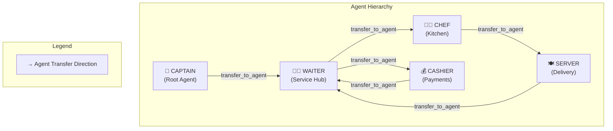
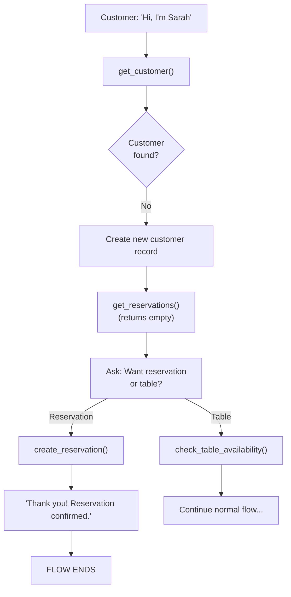
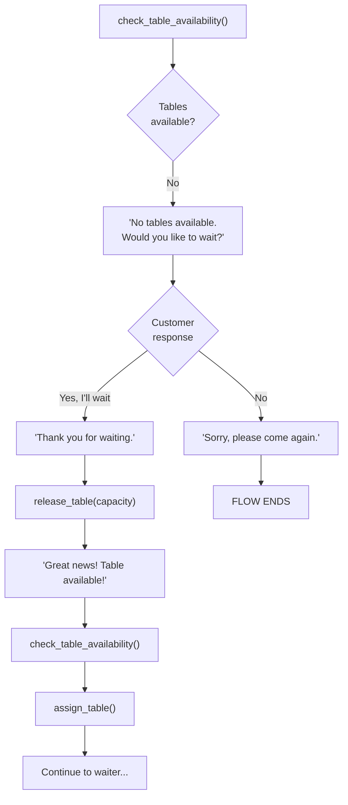
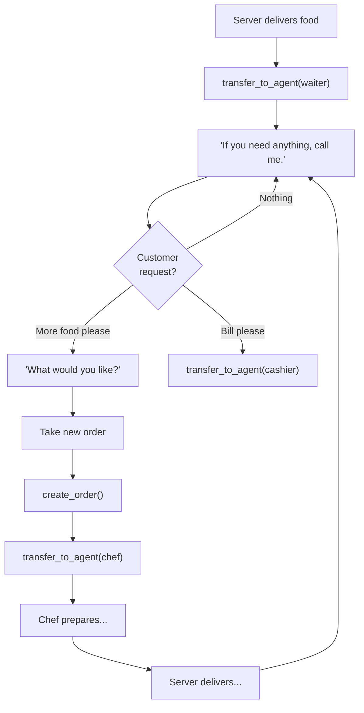
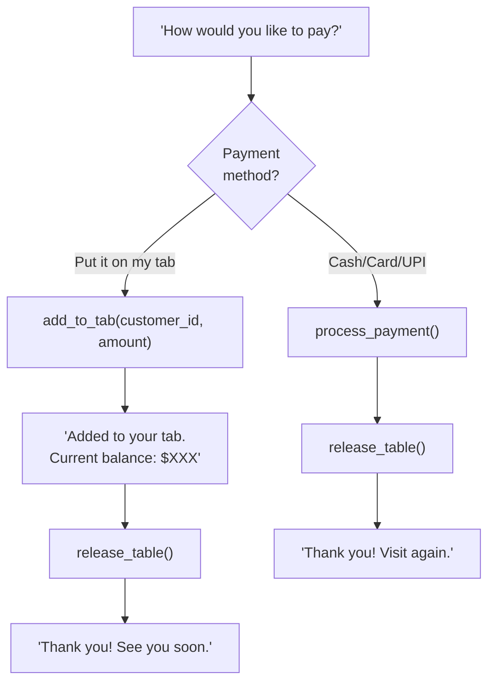
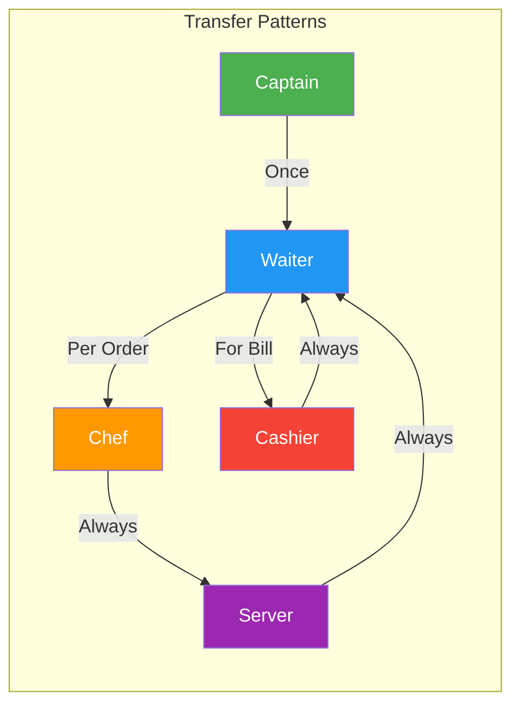

# Restaurant Squad - Complete Agent Flow Documentation 🍽️

This document provides an exhaustive, step-by-step breakdown of how the Restaurant Squad multi-agent system operates from customer arrival to departure.

---

## Table of Contents

1. [System Architecture Overview](#system-architecture-overview)
2. [Agent Hierarchy & Relationships](#agent-hierarchy--relationships)
3. [Backend Tools Reference](#backend-tools-reference)
4. [Complete Flow Diagrams](#complete-flow-diagrams)
5. [Phase 1: Customer Arrival (Captain Agent)](#phase-1-customer-arrival-captain-agent)
6. [Phase 2: Service & Ordering (Waiter Agent)](#phase-2-service--ordering-waiter-agent)
7. [Phase 3: Kitchen Operations (Chef Agent)](#phase-3-kitchen-operations-chef-agent)
8. [Phase 4: Food Delivery (Server Agent)](#phase-4-food-delivery-server-agent)
9. [Phase 5: Billing (Cashier Agent)](#phase-5-billing-cashier-agent)
10. [Phase 6: Payment & Departure (Waiter Agent)](#phase-6-payment--departure-waiter-agent)
11. [Alternative Flows](#alternative-flows)
12. [Callback Enforcement Mechanisms](#callback-enforcement-mechanisms)
13. [State Management](#state-management)

---

## System Architecture Overview

```
┌─────────────────────────────────────────────────────────────────────────────┐
│                          RESTAURANT SQUAD SYSTEM                            │
├─────────────────────────────────────────────────────────────────────────────┤
│                                                                             │
│   ┌─────────────────────────────────────────────────────────────────────┐   │
│   │                         USER INTERFACE                               │   │
│   │              (CLI / ADK Web UI / Voice Interface)                    │   │
│   └───────────────────────────────┬─────────────────────────────────────┘   │
│                                   │                                         │
│                                   ▼                                         │
│   ┌─────────────────────────────────────────────────────────────────────┐   │
│   │                      AGENT ORCHESTRATION LAYER                       │   │
│   │                     (Google ADK Framework)                           │   │
│   │  ┌─────────────────────────────────────────────────────────────────┐│   │
│   │  │                                                                 ││   │
│   │  │   CAPTAIN ──────► WAITER ──────► CHEF ──────► SERVER           ││   │
│   │  │   (Root)           │              │              │             ││   │
│   │  │                    │              │              │             ││   │
│   │  │                    ▼              │              ▼             ││   │
│   │  │                 CASHIER ◄─────────┘         back to WAITER     ││   │
│   │  │                                                                 ││   │
│   │  └─────────────────────────────────────────────────────────────────┘│   │
│   └───────────────────────────────┬─────────────────────────────────────┘   │
│                                   │                                         │
│                                   ▼                                         │
│   ┌─────────────────────────────────────────────────────────────────────┐   │
│   │                    MCP TOOLSET (HTTP Connection)                     │   │
│   │                  StreamableHTTPConnectionParams                      │   │
│   └───────────────────────────────┬─────────────────────────────────────┘   │
│                                   │                                         │
│                                   ▼                                         │
│   ┌─────────────────────────────────────────────────────────────────────┐   │
│   │                    FASTMCP BACKEND SERVER                            │   │
│   │                    (JSON-RPC 2.0 over HTTP)                          │   │
│   │  ┌─────────────────────────────────────────────────────────────────┐│   │
│   │  │                    DATA LAYER (JSON Files)                      ││   │
│   │  │  ┌──────────┬──────────┬────────┬────────┬────────┬────────┐   ││   │
│   │  │  │customers │reserva-  │ tables │  menu  │ orders │ bills  │   ││   │
│   │  │  │  .json   │tions.json│  .json │  .json │  .json │  .json │   ││   │
│   │  │  └──────────┴──────────┴────────┴────────┴────────┴────────┘   ││   │
│   │  └─────────────────────────────────────────────────────────────────┘│   │
│   └─────────────────────────────────────────────────────────────────────┘   │
│                                                                             │
└─────────────────────────────────────────────────────────────────────────────┘
```

---

## Agent Hierarchy & Relationships



### Agent Responsibilities

| Agent       | Role               | Sub-Agents    | Talks to Customer?    |
| ----------- | ------------------ | ------------- | --------------------- |
| **Captain** | Host/Orchestrator  | Waiter        | ✅ Yes                |
| **Waiter**  | Service Hub        | Chef, Cashier | ✅ Yes                |
| **Chef**    | Kitchen Operations | Server        | ❌ No (behind scenes) |
| **Server**  | Food Delivery      | None          | ⚠️ Minimal            |
| **Cashier** | Bill Generation    | None          | ❌ No (behind scenes) |

---

## Backend Tools Reference

### 14 Available Database Operations

```
┌─────────────────────────────────────────────────────────────────────────┐
│                         BACKEND TOOLS (MCP)                              │
├─────────────────────────────────────────────────────────────────────────┤
│                                                                         │
│  ┌─────────────────────┐  ┌─────────────────────┐  ┌──────────────────┐ │
│  │  CUSTOMER MGMT      │  │  RESERVATION MGMT   │  │   TABLE MGMT     │ │
│  │  ─────────────────  │  │  ─────────────────  │  │  ──────────────  │ │
│  │  • get_customer     │  │  • get_reservations │  │  • check_table_  │ │
│  │    (find/create)    │  │  • create_          │  │    availability  │ │
│  │                     │  │    reservation      │  │  • assign_table  │ │
│  │                     │  │                     │  │  • release_table │ │
│  └─────────────────────┘  └─────────────────────┘  └──────────────────┘ │
│                                                                         │
│  ┌─────────────────────┐  ┌─────────────────────┐  ┌──────────────────┐ │
│  │    MENU MGMT        │  │    ORDER MGMT       │  │  PAYMENT MGMT    │ │
│  │  ─────────────────  │  │  ─────────────────  │  │  ──────────────  │ │
│  │  • get_menu         │  │  • get_customer_    │  │  • generate_bill │ │
│  │    (with category   │  │    orders           │  │  • process_      │ │
│  │     filter)         │  │  • create_order     │  │    payment       │ │
│  │                     │  │  • get_order_status │  │  • add_to_tab    │ │
│  │                     │  │  • update_order_    │  │                  │ │
│  │                     │  │    status           │  │                  │ │
│  └─────────────────────┘  └─────────────────────┘  └──────────────────┘ │
│                                                                         │
└─────────────────────────────────────────────────────────────────────────┘
```

---

## Complete Flow Diagrams

### Master Flow - The Complete Customer Journey

```mermaid
flowchart TD
    subgraph ARRIVAL["Phase 1: ARRIVAL (Captain)"]
        A1[Customer Arrives] --> A2[Captain Greets]
        A2 --> A3["Ask name & phone"]
        A3 --> A4["get_customer()"]
        A4 --> A5{"Customer<br/>exists?"}
        A5 -->|No| A6["Create new customer"]
        A5 -->|Yes| A7["Customer found"]
        A6 --> A7
        A7 --> A8["get_reservations()"]
        A8 --> A9{"Reservation<br/>exists?"}
        A9 -->|Yes| A10["Inform customer<br/>about reservation"]
        A9 -->|No| A11{"Want to make<br/>reservation?"}
        A11 -->|Yes| A12["create_reservation()"]
        A12 --> END1["Thank you, goodbye<br/>(FLOW ENDS)"]
        A11 -->|No| A10
        A10 --> A13["check_table_availability()"]
        A13 --> A14{"Table<br/>available?"}
        A14 -->|Yes| A15["assign_table()"]
        A14 -->|No| A16{"Customer<br/>wants to wait?"}
        A16 -->|Yes| A17["Wait → release_table()"]
        A17 --> A13
        A16 -->|No| END2["Sorry, come again<br/>(FLOW ENDS)"]
        A15 --> A18["Guide to table"]
        A18 --> A19["transfer_to_agent(waiter)"]
    end

    subgraph SERVICE["Phase 2: SERVICE (Waiter)"]
        A19 --> B1["get_customer_orders()"]
        B1 --> B2["get_menu()"]
        B2 --> B3["Greet with personalization"]
        B3 --> B4["Present menu"]
        B4 --> B5["Take order"]
        B5 --> B6{"Anything else?"}
        B6 -->|Yes| B5
        B6 -->|No| B7["create_order()"]
        B7 --> B8["transfer_to_agent(chef)"]
    end

    subgraph KITCHEN["Phase 3: KITCHEN (Chef)"]
        B8 --> C1["Receive order"]
        C1 --> C2["update_order_status(ready)"]
        C2 --> C3["transfer_to_agent(server)"]
    end

    subgraph DELIVERY["Phase 4: DELIVERY (Server)"]
        C3 --> D1["Receive ready order"]
        D1 --> D2["update_order_status(served)"]
        D2 --> D3["Deliver to customer"]
        D3 --> D4["transfer_to_agent(waiter)"]
    end

    subgraph POST_MEAL["Phase 5+6: POST-MEAL (Waiter)"]
        D4 --> E1["Tell customer: call if needed"]
        E1 --> E2{"Customer<br/>request?"}
        E2 -->|More food| B5
        E2 -->|Bill please| E3["transfer_to_agent(cashier)"]
        E3 --> E4["generate_bill()"]
        E4 --> E5["transfer_to_agent(waiter)"]
        E5 --> E6["Present bill"]
        E6 --> E7["Ask payment method"]
        E7 --> E8["process_payment()"]
        E8 --> E9["release_table()"]
        E9 --> E10["Thank you, goodbye"]
    end

    style ARRIVAL fill:#e1f5fe
    style SERVICE fill:#f3e5f5
    style KITCHEN fill:#fff3e0
    style DELIVERY fill:#e8f5e9
    style POST_MEAL fill:#fce4ec
```



---

## Phase 1: Customer Arrival (Captain Agent)

The Captain Agent is the **root agent** and first point of contact.

### Detailed Step-by-Step Flow

```
┌────────────────────────────────────────────────────────────────────────────┐
│                     CAPTAIN AGENT - ARRIVAL WORKFLOW                        │
├────────────────────────────────────────────────────────────────────────────┤
│                                                                            │
│  STEP 1: GREETING                                                          │
│  ════════════════                                                          │
│  User: "Hi" / "Hello" / walks in                                           │
│                    │                                                       │
│                    ▼                                                       │
│  Captain: "Hello! Welcome to our restaurant. Can I get your name           │
│            and phone number?"                                              │
│                                                                            │
├────────────────────────────────────────────────────────────────────────────┤
│                                                                            │
│  STEP 2: CUSTOMER IDENTIFICATION                                           │
│  ══════════════════════════════                                            │
│  User: "My name is John, phone 555-1234"                                   │
│                    │                                                       │
│                    ▼                                                       │
│  ┌──────────────────────────────────────────────────────────────────────┐  │
│  │ TOOL CALL: get_customer(name="John", phone="555-1234")               │  │
│  │                                                                      │  │
│  │ Response (if found):                                                 │  │
│  │   {"status": "found", "customer": {"id": "abc123", "name": "John"}}  │  │
│  │                                                                      │  │
│  │ Response (if new):                                                   │  │
│  │   {"status": "created", "customer": {"id": "xyz789", "name": "John"}}│  │
│  └──────────────────────────────────────────────────────────────────────┘  │
│                                                                            │
├────────────────────────────────────────────────────────────────────────────┤
│                                                                            │
│  STEP 3: RESERVATION CHECK (AUTOMATIC - NEVER ASK CUSTOMER)                │
│  ═══════════════════════════════════════════════════════════               │
│  ⚠️  CRITICAL: Captain MUST check automatically, not ask customer          │
│                    │                                                       │
│                    ▼                                                       │
│  ┌──────────────────────────────────────────────────────────────────────┐  │
│  │ TOOL CALL: get_reservations(customer_id="abc123")                    │  │
│  │                                                                      │  │
│  │ Response (if exists):                                                │  │
│  │   {"status": "success", "reservations": [                            │  │
│  │     {"id": "res01", "date": "2025-12-01", "time": "19:00",           │  │
│  │      "party_size": 4, "status": "confirmed"}                         │  │
│  │   ]}                                                                 │  │
│  │                                                                      │  │
│  │ Response (if none):                                                  │  │
│  │   {"status": "success", "reservations": []}                          │  │
│  └──────────────────────────────────────────────────────────────────────┘  │
│                                                                            │
│                    │                                                       │
│          ┌────────┴────────┐                                               │
│          │                 │                                               │
│          ▼                 ▼                                               │
│   [RESERVATION FOUND]  [NO RESERVATION]                                    │
│          │                 │                                               │
│          │                 ▼                                               │
│          │    Captain: "Would you like to make a reservation,              │
│          │              or proceed directly to a table?"                   │
│          │                 │                                               │
│          │       ┌────────┴────────┐                                       │
│          │       │                 │                                       │
│          │       ▼                 ▼                                       │
│          │  [WANTS RESERVATION] [PROCEED DIRECTLY]                         │
│          │       │                 │                                       │
│          │       ▼                 │                                       │
│          │  create_reservation()   │                                       │
│          │       │                 │                                       │
│          │       ▼                 │                                       │
│          │  "Thank you! Your       │                                       │
│          │   reservation is        │                                       │
│          │   confirmed. Goodbye!"  │                                       │
│          │       │                 │                                       │
│          │       ▼                 │                                       │
│          │  [FLOW ENDS]            │                                       │
│          │                         │                                       │
│          └────────┬────────────────┘                                       │
│                   │                                                        │
│                   ▼                                                        │
├────────────────────────────────────────────────────────────────────────────┤
│                                                                            │
│  STEP 4: TABLE AVAILABILITY CHECK                                          │
│  ════════════════════════════════                                          │
│                    │                                                       │
│                    ▼                                                       │
│  Captain: "I found your reservation for 7:00 PM for 4 people."             │
│           (if reservation exists)                                          │
│                    │                                                       │
│                    ▼                                                       │
│  ┌──────────────────────────────────────────────────────────────────────┐  │
│  │ TOOL CALL: check_table_availability(party_size=4)                    │  │
│  │                                                                      │  │
│  │ Response (if available):                                             │  │
│  │   {"status": "success", "available_tables": [                        │  │
│  │     {"id": "table05", "capacity": 4, "status": "available"}          │  │
│  │   ], "count": 1}                                                     │  │
│  │                                                                      │  │
│  │ Response (if none):                                                  │  │
│  │   {"status": "success", "available_tables": [], "count": 0}          │  │
│  └──────────────────────────────────────────────────────────────────────┘  │
│                                                                            │
│                    │                                                       │
│          ┌────────┴────────┐                                               │
│          │                 │                                               │
│          ▼                 ▼                                               │
│    [TABLES AVAILABLE] [NO TABLES]                                          │
│          │                 │                                               │
│          │                 ▼                                               │
│          │    Captain: "Unfortunately no tables are available.             │
│          │              Would you like to wait?"                           │
│          │                 │                                               │
│          │       ┌────────┴────────┐                                       │
│          │       │                 │                                       │
│          │       ▼                 ▼                                       │
│          │  [WILL WAIT]      [WON'T WAIT]                                  │
│          │       │                 │                                       │
│          │       ▼                 ▼                                       │
│          │  release_table()   "Sorry, please                               │
│          │       │             come again later"                           │
│          │       │                 │                                       │
│          │       ▼                 ▼                                       │
│          │  check_table_       [FLOW ENDS]                                 │
│          │  availability()                                                 │
│          │       │                                                         │
│          └───────┤                                                         │
│                  │                                                         │
│                  ▼                                                         │
├────────────────────────────────────────────────────────────────────────────┤
│                                                                            │
│  STEP 5: TABLE ASSIGNMENT                                                  │
│  ═══════════════════════                                                   │
│                    │                                                       │
│                    ▼                                                       │
│  ┌──────────────────────────────────────────────────────────────────────┐  │
│  │ TOOL CALL: assign_table(customer_id="abc123", table_id="table05")    │  │
│  │                                                                      │  │
│  │ Response:                                                            │  │
│  │   {"status": "success", "table": {                                   │  │
│  │     "id": "table05", "status": "occupied",                           │  │
│  │     "customer_id": "abc123", "seated_at": "2025-12-01T19:00:00"      │  │
│  │   }}                                                                 │  │
│  └──────────────────────────────────────────────────────────────────────┘  │
│                                                                            │
├────────────────────────────────────────────────────────────────────────────┤
│                                                                            │
│  STEP 6: GUIDE TO TABLE & TRANSFER                                         │
│  ═══════════════════════════════                                           │
│                    │                                                       │
│                    ▼                                                       │
│  Captain: "Please follow me to table 5."                                   │
│                    │                                                       │
│                    ▼                                                       │
│  User: "Thank you!"                                                        │
│                    │                                                       │
│                    ▼                                                       │
│  ┌──────────────────────────────────────────────────────────────────────┐  │
│  │ FUNCTION CALL: transfer_to_agent(agent_name="waiter_agent")          │  │
│  │                                                                      │  │
│  │ Transfer Message: "Customer John (ID: abc123) has been seated at     │  │
│  │                    table05. Please assist them with the menu."       │  │
│  └──────────────────────────────────────────────────────────────────────┘  │
│                                                                            │
│                    │                                                       │
│                    ▼                                                       │
│            [WAITER AGENT TAKES OVER]                                       │
│                                                                            │
└────────────────────────────────────────────────────────────────────────────┘
```

### Captain Workflow Enforcement (Callback)

The system uses `enforce_captain_workflow` callback to ensure the correct sequence:

```python
CAPTAIN_WORKFLOW_TOOLS = [
    "get_customer",           # Step 1
    "get_reservations",       # Step 2 (MUST follow Step 1)
    "check_table_availability", # Step 3
    "assign_table",           # Step 4
    "transfer_to_agent"       # Step 5
]
```

---

## Phase 2: Service & Ordering (Waiter Agent)

The Waiter Agent is the **service hub** - the main point of contact for seated customers.

### Detailed Step-by-Step Flow

```
┌────────────────────────────────────────────────────────────────────────────┐
│                      WAITER AGENT - SERVICE WORKFLOW                        │
├────────────────────────────────────────────────────────────────────────────┤
│                                                                            │
│  ⚠️  CRITICAL FIRST STEPS (MANDATORY BEFORE ANY INTERACTION)               │
│  ════════════════════════════════════════════════════════════              │
│                                                                            │
│  STEP 1: FETCH CUSTOMER ORDER HISTORY                                      │
│  ─────────────────────────────────────                                     │
│  ┌──────────────────────────────────────────────────────────────────────┐  │
│  │ TOOL CALL: get_customer_orders(customer_id="abc123", limit=5)        │  │
│  │                                                                      │  │
│  │ Response:                                                            │  │
│  │   {"status": "success", "orders": [                                  │  │
│  │     {"items": [{"name": "Ribeye Steak", "quantity": 1}], ...},       │  │
│  │     {"items": [{"name": "Calamari", "quantity": 2}], ...}            │  │
│  │   ]}                                                                 │  │
│  └──────────────────────────────────────────────────────────────────────┘  │
│                                                                            │
│  STEP 2: FETCH MENU                                                        │
│  ──────────────────                                                        │
│  ┌──────────────────────────────────────────────────────────────────────┐  │
│  │ TOOL CALL: get_menu()                                                │  │
│  │                                                                      │  │
│  │ Response:                                                            │  │
│  │   {"status": "success", "items": [                                   │  │
│  │     {"name": "Ribeye Steak", "price": 45.99, "category": "mains"},   │  │
│  │     {"name": "Calamari", "price": 14.99, "category": "appetizers"},  │  │
│  │     {"name": "Fresh Lemonade", "price": 4.99, "category": "drinks"}, │  │
│  │     ...                                                              │  │
│  │   ]}                                                                 │  │
│  └──────────────────────────────────────────────────────────────────────┘  │
│                                                                            │
├────────────────────────────────────────────────────────────────────────────┤
│                                                                            │
│  STEP 3: PERSONALIZED GREETING                                             │
│  ════════════════════════════                                              │
│                    │                                                       │
│                    ▼                                                       │
│  Waiter: "Hello John! It's great to see you again. I see you've           │
│           enjoyed our Ribeye Steak and Calamari in the past!              │
│                                                                            │
│           Here is our menu:                                                │
│                                                                            │
│           🍤 APPETIZERS                                                    │
│           • Calamari - $14.99                                              │
│           • Bruschetta - $9.99                                             │
│           • Caesar Salad - $11.99                                          │
│                                                                            │
│           🥩 MAINS                                                         │
│           • Ribeye Steak - $45.99                                          │
│           • Grilled Salmon - $32.99                                        │
│           • Chicken Parmesan - $24.99                                      │
│                                                                            │
│           🍰 DESSERTS                                                      │
│           • Tiramisu - $8.99                                               │
│           • Cheesecake - $7.99                                             │
│                                                                            │
│           🍹 DRINKS                                                        │
│           • Fresh Lemonade - $4.99                                         │
│           • Iced Tea - $3.99                                               │
│                                                                            │
│           What would you like to order?"                                   │
│                                                                            │
├────────────────────────────────────────────────────────────────────────────┤
│                                                                            │
│  STEP 4: TAKING THE ORDER                                                  │
│  ═══════════════════════                                                   │
│                    │                                                       │
│                    ▼                                                       │
│  User: "I'll have 2 Ribeye Steaks and 1 Calamari"                          │
│                    │                                                       │
│                    ▼                                                       │
│  Waiter: "Excellent choice! Would you like anything else?"                 │
│                    │                                                       │
│                    ▼                                                       │
│  User: "That's all for now"                                                │
│                    │                                                       │
│                    ▼                                                       │
│  ┌──────────────────────────────────────────────────────────────────────┐  │
│  │ TOOL CALL: create_order(                                             │  │
│  │   customer_id="abc123",                                              │  │
│  │   table_id="table05",                                                │  │
│  │   items=[                                                            │  │
│  │     {"name": "Ribeye Steak", "quantity": 2},                         │  │
│  │     {"name": "Calamari", "quantity": 1}                              │  │
│  │   ]                                                                  │  │
│  │ )                                                                    │  │
│  │                                                                      │  │
│  │ Response:                                                            │  │
│  │   {"status": "created", "order": {                                   │  │
│  │     "id": "ord001",                                                  │  │
│  │     "items": [                                                       │  │
│  │       {"name": "Ribeye Steak", "price": 45.99, "quantity": 2},       │  │
│  │       {"name": "Calamari", "price": 14.99, "quantity": 1}            │  │
│  │     ],                                                               │  │
│  │     "total": 106.97,                                                 │  │
│  │     "status": "pending"                                              │  │
│  │   }}                                                                 │  │
│  └──────────────────────────────────────────────────────────────────────┘  │
│                                                                            │
├────────────────────────────────────────────────────────────────────────────┤
│                                                                            │
│  STEP 5: TRANSFER TO KITCHEN                                               │
│  ═══════════════════════════                                               │
│                    │                                                       │
│                    ▼                                                       │
│  Waiter: "Your order will be ready shortly!"                               │
│                    │                                                       │
│                    ▼                                                       │
│  User: "OK"                                                                │
│                    │                                                       │
│                    ▼                                                       │
│  ┌──────────────────────────────────────────────────────────────────────┐  │
│  │ FUNCTION CALL: transfer_to_agent(agent_name="chef_agent")            │  │
│  │                                                                      │  │
│  │ Transfer Message: "Order ord001 for customer abc123 at table05:      │  │
│  │                    2x Ribeye Steak, 1x Calamari. Total: $106.97"     │  │
│  └──────────────────────────────────────────────────────────────────────┘  │
│                                                                            │
│                    │                                                       │
│                    ▼                                                       │
│            [CHEF AGENT TAKES OVER]                                         │
│                                                                            │
└────────────────────────────────────────────────────────────────────────────┘
```

### Waiter Prerequisite Enforcement (Callback)

```python
REQUIRED_WAITER_TOOLS = {"get_customer_orders", "get_menu"}
```

The `enforce_waiter_prerequisites` callback ensures these are called BEFORE any customer interaction.

---

## Phase 3: Kitchen Operations (Chef Agent)

The Chef Agent works **behind the scenes** - no direct customer interaction.

```
┌────────────────────────────────────────────────────────────────────────────┐
│                        CHEF AGENT - KITCHEN WORKFLOW                        │
├────────────────────────────────────────────────────────────────────────────┤
│                                                                            │
│  STEP 1: RECEIVE ORDER                                                     │
│  ═════════════════════                                                     │
│                    │                                                       │
│                    ▼                                                       │
│  Chef: (Internal) "Order received: 2x Ribeye Steak, 1x Calamari"           │
│                                                                            │
├────────────────────────────────────────────────────────────────────────────┤
│                                                                            │
│  STEP 2: UPDATE ORDER STATUS TO READY                                      │
│  ════════════════════════════════════                                      │
│                    │                                                       │
│                    ▼                                                       │
│  ┌──────────────────────────────────────────────────────────────────────┐  │
│  │ TOOL CALL: update_order_status(order_id="ord001", status="ready")    │  │
│  │                                                                      │  │
│  │ Response:                                                            │  │
│  │   {"status": "success", "order": {                                   │  │
│  │     "id": "ord001",                                                  │  │
│  │     "status": "ready",                                               │  │
│  │     "updated_at": "2025-12-01T19:15:00"                              │  │
│  │   }}                                                                 │  │
│  └──────────────────────────────────────────────────────────────────────┘  │
│                                                                            │
├────────────────────────────────────────────────────────────────────────────┤
│                                                                            │
│  STEP 3: TRANSFER TO SERVER                                                │
│  ════════════════════════                                                  │
│                    │                                                       │
│                    ▼                                                       │
│  Chef: (Internal) "Dishes ready! Transferring to server for delivery."     │
│                    │                                                       │
│                    ▼                                                       │
│  ┌──────────────────────────────────────────────────────────────────────┐  │
│  │ FUNCTION CALL: transfer_to_agent(agent_name="server_agent")          │  │
│  │                                                                      │  │
│  │ Transfer Message: "Order ord001 is ready for delivery to table05:    │  │
│  │                    2x Ribeye Steak, 1x Calamari"                      │  │
│  └──────────────────────────────────────────────────────────────────────┘  │
│                                                                            │
│                    │                                                       │
│                    ▼                                                       │
│            [SERVER AGENT TAKES OVER]                                       │
│                                                                            │
└────────────────────────────────────────────────────────────────────────────┘
```

---

## Phase 4: Food Delivery (Server Agent)

The Server Agent has **minimal customer interaction** - just delivery message.

```
┌────────────────────────────────────────────────────────────────────────────┐
│                       SERVER AGENT - DELIVERY WORKFLOW                      │
├────────────────────────────────────────────────────────────────────────────┤
│                                                                            │
│  STEP 1: RECEIVE READY ORDER                                               │
│  ═══════════════════════════                                               │
│                    │                                                       │
│                    ▼                                                       │
│  Server: (Internal) "Received ready order for table05"                     │
│                                                                            │
├────────────────────────────────────────────────────────────────────────────┤
│                                                                            │
│  STEP 2: UPDATE ORDER STATUS TO SERVED                                     │
│  ═════════════════════════════════════                                     │
│                    │                                                       │
│                    ▼                                                       │
│  ┌──────────────────────────────────────────────────────────────────────┐  │
│  │ TOOL CALL: update_order_status(order_id="ord001", status="served")   │  │
│  │                                                                      │  │
│  │ Response:                                                            │  │
│  │   {"status": "success", "order": {                                   │  │
│  │     "id": "ord001",                                                  │  │
│  │     "status": "served",                                              │  │
│  │     "updated_at": "2025-12-01T19:20:00"                              │  │
│  │   }}                                                                 │  │
│  └──────────────────────────────────────────────────────────────────────┘  │
│                                                                            │
├────────────────────────────────────────────────────────────────────────────┤
│                                                                            │
│  STEP 3: DELIVER TO CUSTOMER                                               │
│  ═══════════════════════════                                               │
│                    │                                                       │
│                    ▼                                                       │
│  Server: "Here is your order. Hope you enjoy it!"                          │
│                                                                            │
├────────────────────────────────────────────────────────────────────────────┤
│                                                                            │
│  STEP 4: TRANSFER BACK TO WAITER                                           │
│  ═══════════════════════════════                                           │
│                    │                                                       │
│                    ▼                                                       │
│  ┌──────────────────────────────────────────────────────────────────────┐  │
│  │ FUNCTION CALL: transfer_to_agent(agent_name="waiter_agent")          │  │
│  │                                                                      │  │
│  │ Transfer Message: "Order ord001 delivered to table05. Customer       │  │
│  │                    abc123 has been served."                          │  │
│  └──────────────────────────────────────────────────────────────────────┘  │
│                                                                            │
│                    │                                                       │
│                    ▼                                                       │
│            [WAITER AGENT TAKES OVER]                                       │
│                                                                            │
└────────────────────────────────────────────────────────────────────────────┘
```

---

## Phase 5: Billing (Cashier Agent)

The Cashier Agent works **behind the scenes** - generates bill and returns to waiter.

```
┌────────────────────────────────────────────────────────────────────────────┐
│                      CASHIER AGENT - BILLING WORKFLOW                       │
├────────────────────────────────────────────────────────────────────────────┤
│                                                                            │
│  ⚠️  ONLY TRIGGERED WHEN CUSTOMER EXPLICITLY ASKS FOR BILL                 │
│                                                                            │
│  STEP 1: RECEIVE BILLING REQUEST                                           │
│  ═══════════════════════════════                                           │
│                    │                                                       │
│                    ▼                                                       │
│  Cashier: (Internal) "Generating bill for customer abc123"                 │
│                                                                            │
├────────────────────────────────────────────────────────────────────────────┤
│                                                                            │
│  STEP 2: GENERATE BILL                                                     │
│  ════════════════════                                                      │
│                    │                                                       │
│                    ▼                                                       │
│  ┌──────────────────────────────────────────────────────────────────────┐  │
│  │ TOOL CALL: generate_bill(customer_id="abc123")                       │  │
│  │                                                                      │  │
│  │ Response:                                                            │  │
│  │   {"status": "success", "bill": {                                    │  │
│  │     "id": "bill001",                                                 │  │
│  │     "customer_id": "abc123",                                         │  │
│  │     "orders": ["ord001", "ord002"],                                  │  │
│  │     "subtotal": 131.94,                                              │  │
│  │     "tax": 10.56,                     ← 8% tax                       │  │
│  │     "total": 142.50,                                                 │  │
│  │     "status": "pending"                                              │  │
│  │   }}                                                                 │  │
│  └──────────────────────────────────────────────────────────────────────┘  │
│                                                                            │
├────────────────────────────────────────────────────────────────────────────┤
│                                                                            │
│  STEP 3: TRANSFER BACK TO WAITER WITH BILL                                 │
│  ═════════════════════════════════════════                                 │
│                    │                                                       │
│                    ▼                                                       │
│  ┌──────────────────────────────────────────────────────────────────────┐  │
│  │ FUNCTION CALL: transfer_to_agent(agent_name="waiter_agent")          │  │
│  │                                                                      │  │
│  │ Transfer Message: "Bill generated for customer abc123:               │  │
│  │                    Subtotal: $131.94, Tax: $10.56, Total: $142.50    │  │
│  │                    Bill ID: bill001"                                 │  │
│  └──────────────────────────────────────────────────────────────────────┘  │
│                                                                            │
│                    │                                                       │
│                    ▼                                                       │
│            [WAITER AGENT TAKES OVER]                                       │
│                                                                            │
└────────────────────────────────────────────────────────────────────────────┘
```

---

## Phase 6: Payment & Departure (Waiter Agent)

The Waiter Agent handles post-meal service and payment processing.

```
┌────────────────────────────────────────────────────────────────────────────┐
│                    WAITER AGENT - PAYMENT WORKFLOW                          │
├────────────────────────────────────────────────────────────────────────────┤
│                                                                            │
│  [After Server delivers food and transfers back]                           │
│                                                                            │
│  STEP 1: POST-MEAL CHECK-IN                                                │
│  ══════════════════════════                                                │
│                    │                                                       │
│                    ▼                                                       │
│  Waiter: "If you need anything else, please call me."                      │
│                    │                                                       │
│                    ▼                                                       │
│  ┌─────────────────────────────────────────────────────────────────────┐   │
│  │ Customer can:                                                       │   │
│  │   • Order more food  → Back to Taking Order flow                    │   │
│  │   • Ask for the bill → Continue below                               │   │
│  │   • Wait/enjoy meal  → Waiter waits                                 │   │
│  └─────────────────────────────────────────────────────────────────────┘   │
│                                                                            │
├────────────────────────────────────────────────────────────────────────────┤
│                                                                            │
│  [When customer asks for bill - Waiter transfers to Cashier]               │
│  [Cashier generates bill and transfers back - see Phase 5]                 │
│                                                                            │
│  STEP 2: PRESENT BILL                                                      │
│  ════════════════════                                                      │
│                    │                                                       │
│                    ▼                                                       │
│  Waiter: "Here is your bill:                                               │
│                                                                            │
│           ┌────────────────────────────────────────────┐                   │
│           │            RESTAURANT BILL                 │                   │
│           ├────────────────────────────────────────────┤                   │
│           │ 2x Ribeye Steak        $91.98              │                   │
│           │ 1x Calamari            $14.99              │                   │
│           │ 5x Fresh Lemonade      $24.95              │                   │
│           ├────────────────────────────────────────────┤                   │
│           │ Subtotal:              $131.92             │                   │
│           │ Tax (8%):              $10.55              │                   │
│           ├────────────────────────────────────────────┤                   │
│           │ TOTAL:                 $142.47             │                   │
│           └────────────────────────────────────────────┘                   │
│                                                                            │
│           How would you like to pay? (Cash, Card, or UPI)"                 │
│                                                                            │
├────────────────────────────────────────────────────────────────────────────┤
│                                                                            │
│  STEP 3: PROCESS PAYMENT                                                   │
│  ════════════════════════                                                  │
│                    │                                                       │
│                    ▼                                                       │
│  User: "Card please"                                                       │
│                    │                                                       │
│                    ▼                                                       │
│  ┌──────────────────────────────────────────────────────────────────────┐  │
│  │ TOOL CALL: process_payment(bill_id="bill001", payment_method="card") │  │
│  │                                                                      │  │
│  │ Response:                                                            │  │
│  │   {"status": "success",                                              │  │
│  │    "message": "Payment processed successfully",                      │  │
│  │    "bill": {                                                         │  │
│  │      "id": "bill001",                                                │  │
│  │      "status": "paid",                                               │  │
│  │      "payment_method": "card",                                       │  │
│  │      "paid_at": "2025-12-01T20:30:00"                                │  │
│  │    }}                                                                │  │
│  └──────────────────────────────────────────────────────────────────────┘  │
│                                                                            │
├────────────────────────────────────────────────────────────────────────────┤
│                                                                            │
│  STEP 4: RELEASE TABLE                                                     │
│  ═════════════════════                                                     │
│                    │                                                       │
│                    ▼                                                       │
│  ┌──────────────────────────────────────────────────────────────────────┐  │
│  │ TOOL CALL: release_table(capacity=4)                                 │  │
│  │   (Note: In deployment, uses table_id directly)                      │  │
│  │                                                                      │  │
│  │ Response:                                                            │  │
│  │   {"status": "success", "table": {                                   │  │
│  │     "id": "table05",                                                 │  │
│  │     "status": "available",                                           │  │
│  │     "customer_id": null                                              │  │
│  │   }}                                                                 │  │
│  └──────────────────────────────────────────────────────────────────────┘  │
│                                                                            │
├────────────────────────────────────────────────────────────────────────────┤
│                                                                            │
│  STEP 5: FAREWELL                                                          │
│  ════════════════                                                          │
│                    │                                                       │
│                    ▼                                                       │
│  Waiter: "Thank you for dining with us! Please visit again. Have a         │
│           wonderful day!"                                                  │
│                                                                            │
│                    │                                                       │
│                    ▼                                                       │
│              [FLOW COMPLETE]                                               │
│                                                                            │
└────────────────────────────────────────────────────────────────────────────┘
```

---

## Alternative Flows

### Flow A: New Customer (No Existing Record)



### Flow B: Customer Wants to Wait for Table



### Flow C: Customer Orders Additional Items



### Flow D: Tab Payment (Pay Later)



---

## Callback Enforcement Mechanisms

The system uses **two callback mechanisms** to enforce correct workflow sequences:

### 1. Captain Workflow Enforcement

```python
# File: callbacks.py

def enforce_captain_workflow(callback_context, llm_request):
    """
    Enforces that captain completes workflow in correct order:

    1. get_customer        → MUST be called first
    2. get_reservations    → MUST follow get_customer (automatically!)
    3. check_table_availability → Next step
    4. assign_table        → After tables found
    5. transfer_to_agent   → Final step

    If captain tries to skip steps, callback injects instructions
    to call the next required tool.
    """
```

### 2. Waiter Prerequisites Enforcement

```python
# File: callbacks.py

REQUIRED_WAITER_TOOLS = {"get_customer_orders", "get_menu"}

def enforce_waiter_prerequisites(callback_context, llm_request):
    """
    Enforces that waiter calls required tools BEFORE
    any customer interaction:

    1. get_customer_orders → For personalization
    2. get_menu            → For menu presentation

    If waiter tries to greet customer without calling
    these tools first, callback injects instructions.
    """
```

### Callback Flow Diagram

```
┌─────────────────────────────────────────────────────────────────────────┐
│                      CALLBACK ENFORCEMENT FLOW                           │
├─────────────────────────────────────────────────────────────────────────┤
│                                                                         │
│   Agent wants to respond                                                │
│          │                                                              │
│          ▼                                                              │
│   ┌─────────────────────┐                                               │
│   │ before_model_callback│                                               │
│   │ (enforce_*_workflow) │                                               │
│   └──────────┬──────────┘                                               │
│              │                                                          │
│              ▼                                                          │
│   ┌─────────────────────────────────────────────────┐                   │
│   │ Check: Have required tools been called?          │                   │
│   └──────────┬──────────────────────────────────────┘                   │
│              │                                                          │
│     ┌───────┴───────┐                                                   │
│     │               │                                                   │
│     ▼               ▼                                                   │
│   [YES]          [NO]                                                   │
│     │               │                                                   │
│     │               ▼                                                   │
│     │    ┌─────────────────────────────────┐                            │
│     │    │ Inject instruction into request │                            │
│     │    │ "CRITICAL: Call [tool] NOW"     │                            │
│     │    └──────────┬──────────────────────┘                            │
│     │               │                                                   │
│     └───────┬───────┘                                                   │
│             │                                                           │
│             ▼                                                           │
│      LLM processes request                                              │
│             │                                                           │
│             ▼                                                           │
│   ┌─────────────────────┐                                               │
│   │  after_tool_callback │                                               │
│   │  (track_*_tools)     │                                               │
│   └──────────┬──────────┘                                               │
│              │                                                          │
│              ▼                                                          │
│    Update state to record                                               │
│    that tool was called                                                 │
│                                                                         │
└─────────────────────────────────────────────────────────────────────────┘
```

---

## State Management

### Session State Variables

```python
# Captain workflow state
state["captain_get_customer_called"] = True/False
state["captain_get_reservations_called"] = True/False
state["captain_check_table_availability_called"] = True/False
state["captain_assign_table_called"] = True/False
state["captain_transfer_to_agent_called"] = True/False

# Waiter workflow state
state["waiter_get_customer_orders_called"] = True/False
state["waiter_get_menu_called"] = True/False
```

### Data Flow Between Agents

```
┌─────────────────────────────────────────────────────────────────────────┐
│                     DATA FLOW BETWEEN AGENTS                             │
├─────────────────────────────────────────────────────────────────────────┤
│                                                                         │
│   CAPTAIN ────────────────────────────────────────────► WAITER          │
│   Passes:                                                               │
│   • customer_id                                                         │
│   • table_id                                                            │
│   • customer_name                                                       │
│                                                                         │
│   WAITER ─────────────────────────────────────────────► CHEF            │
│   Passes:                                                               │
│   • order_id                                                            │
│   • items list                                                          │
│   • table_id                                                            │
│   • customer_id                                                         │
│                                                                         │
│   CHEF ───────────────────────────────────────────────► SERVER          │
│   Passes:                                                               │
│   • order_id                                                            │
│   • items list                                                          │
│   • table_id                                                            │
│                                                                         │
│   SERVER ─────────────────────────────────────────────► WAITER          │
│   Passes:                                                               │
│   • order_id                                                            │
│   • delivery confirmation                                               │
│   • customer_id                                                         │
│                                                                         │
│   WAITER ─────────────────────────────────────────────► CASHIER         │
│   Passes:                                                               │
│   • customer_id                                                         │
│                                                                         │
│   CASHIER ────────────────────────────────────────────► WAITER          │
│   Passes:                                                               │
│   • bill_id                                                             │
│   • bill total                                                          │
│   • itemized details                                                    │
│                                                                         │
└─────────────────────────────────────────────────────────────────────────┘
```

---

## Complete Happy Path - End to End

Here's the complete sequence for a returning customer with a reservation:

```
┌─────────────────────────────────────────────────────────────────────────┐
│                    COMPLETE HAPPY PATH - TIMELINE                        │
├─────────────────────────────────────────────────────────────────────────┤
│                                                                         │
│ TIME    │ AGENT    │ ACTION                          │ TOOL CALL        │
│─────────┼──────────┼─────────────────────────────────┼──────────────────│
│ 0:00    │ USER     │ "Hi"                            │                  │
│ 0:01    │ CAPTAIN  │ "Welcome! Name & phone?"        │                  │
│ 0:02    │ USER     │ "John, 555-1234"                │                  │
│ 0:03    │ CAPTAIN  │ Look up customer                │ get_customer()   │
│ 0:04    │ CAPTAIN  │ Check reservations              │ get_reservations()│
│ 0:05    │ CAPTAIN  │ "Found your 7PM reservation!"   │                  │
│ 0:06    │ CAPTAIN  │ Check tables                    │ check_table_...()│
│ 0:07    │ CAPTAIN  │ Assign table                    │ assign_table()   │
│ 0:08    │ CAPTAIN  │ "Follow me to table 5"          │                  │
│ 0:09    │ USER     │ "Thank you!"                    │                  │
│ 0:10    │ CAPTAIN  │ Transfer to waiter              │ transfer_to_agent│
│─────────┼──────────┼─────────────────────────────────┼──────────────────│
│ 0:11    │ WAITER   │ Fetch order history             │ get_customer_    │
│         │          │                                 │ orders()         │
│ 0:12    │ WAITER   │ Fetch menu                      │ get_menu()       │
│ 0:13    │ WAITER   │ "Hello John! I see you love     │                  │
│         │          │  our Ribeye. Here's the menu!"  │                  │
│ 0:14    │ USER     │ "2 Ribeye Steaks, 1 Calamari"   │                  │
│ 0:15    │ WAITER   │ "Anything else?"                │                  │
│ 0:16    │ USER     │ "That's all"                    │                  │
│ 0:17    │ WAITER   │ Create order                    │ create_order()   │
│ 0:18    │ WAITER   │ "Coming right up!"              │                  │
│ 0:19    │ USER     │ "OK"                            │                  │
│ 0:20    │ WAITER   │ Transfer to chef                │ transfer_to_agent│
│─────────┼──────────┼─────────────────────────────────┼──────────────────│
│ 0:21    │ CHEF     │ Acknowledge order               │                  │
│ 0:22    │ CHEF     │ Mark as ready                   │ update_order_    │
│         │          │                                 │ status()         │
│ 0:23    │ CHEF     │ Transfer to server              │ transfer_to_agent│
│─────────┼──────────┼─────────────────────────────────┼──────────────────│
│ 0:24    │ SERVER   │ Acknowledge                     │                  │
│ 0:25    │ SERVER   │ Mark as served                  │ update_order_    │
│         │          │                                 │ status()         │
│ 0:26    │ SERVER   │ "Here's your order. Enjoy!"     │                  │
│ 0:27    │ SERVER   │ Transfer to waiter              │ transfer_to_agent│
│─────────┼──────────┼─────────────────────────────────┼──────────────────│
│ 0:28    │ WAITER   │ "Call if you need anything!"    │                  │
│  ...    │  ...     │ [Customer enjoys meal]          │                  │
│ 0:45    │ USER     │ "Can I get the bill?"           │                  │
│ 0:46    │ WAITER   │ Transfer to cashier             │ transfer_to_agent│
│─────────┼──────────┼─────────────────────────────────┼──────────────────│
│ 0:47    │ CASHIER  │ Generate bill                   │ generate_bill()  │
│ 0:48    │ CASHIER  │ Transfer to waiter              │ transfer_to_agent│
│─────────┼──────────┼─────────────────────────────────┼──────────────────│
│ 0:49    │ WAITER   │ "Here's your bill: $142.50.     │                  │
│         │          │  How would you like to pay?"    │                  │
│ 0:50    │ USER     │ "Card"                          │                  │
│ 0:51    │ WAITER   │ Process payment                 │ process_payment()│
│ 0:52    │ WAITER   │ Release table                   │ release_table()  │
│ 0:53    │ WAITER   │ "Thank you! Visit again!"       │                  │
│─────────┼──────────┼─────────────────────────────────┼──────────────────│
│         │          │      ✅ FLOW COMPLETE           │                  │
└─────────┴──────────┴─────────────────────────────────┴──────────────────┘
```

---

## Summary: Agent Transfer Patterns



### Transfer Rules

| From Agent | To Agent | Trigger                              |
| ---------- | -------- | ------------------------------------ |
| Captain    | Waiter   | Customer seated at table             |
| Waiter     | Chef     | Order created, customer acknowledged |
| Chef       | Server   | Order marked as "ready"              |
| Server     | Waiter   | Order delivered to customer          |
| Waiter     | Cashier  | Customer asks for bill               |
| Cashier    | Waiter   | Bill generated                       |

---

_Built with ❤️ using Google ADK, Gemini, and FastMCP_
